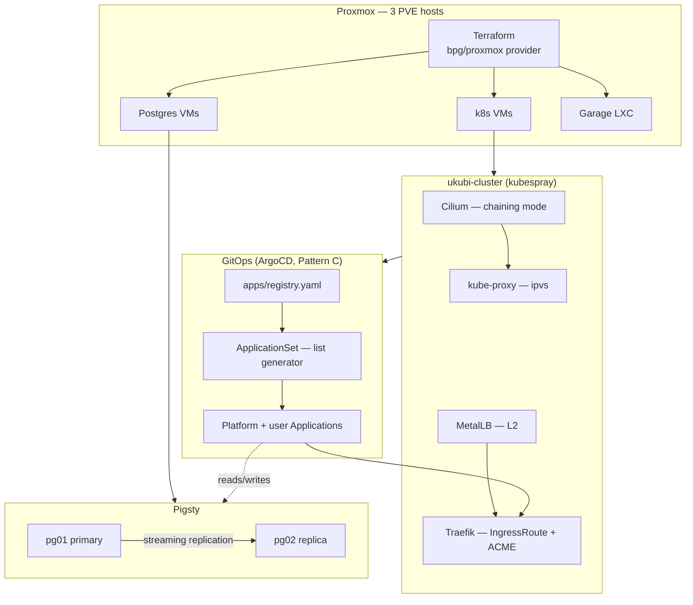
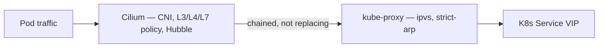
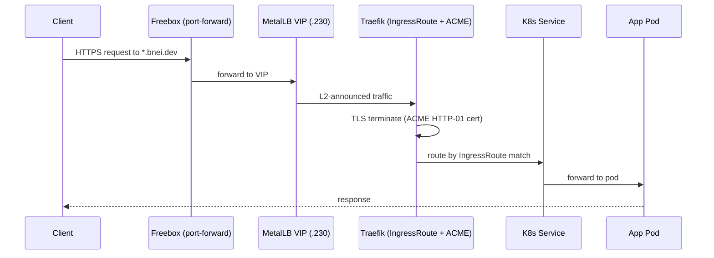
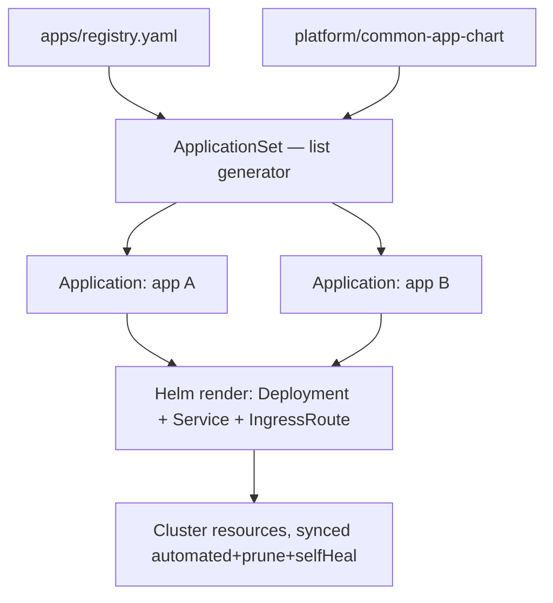
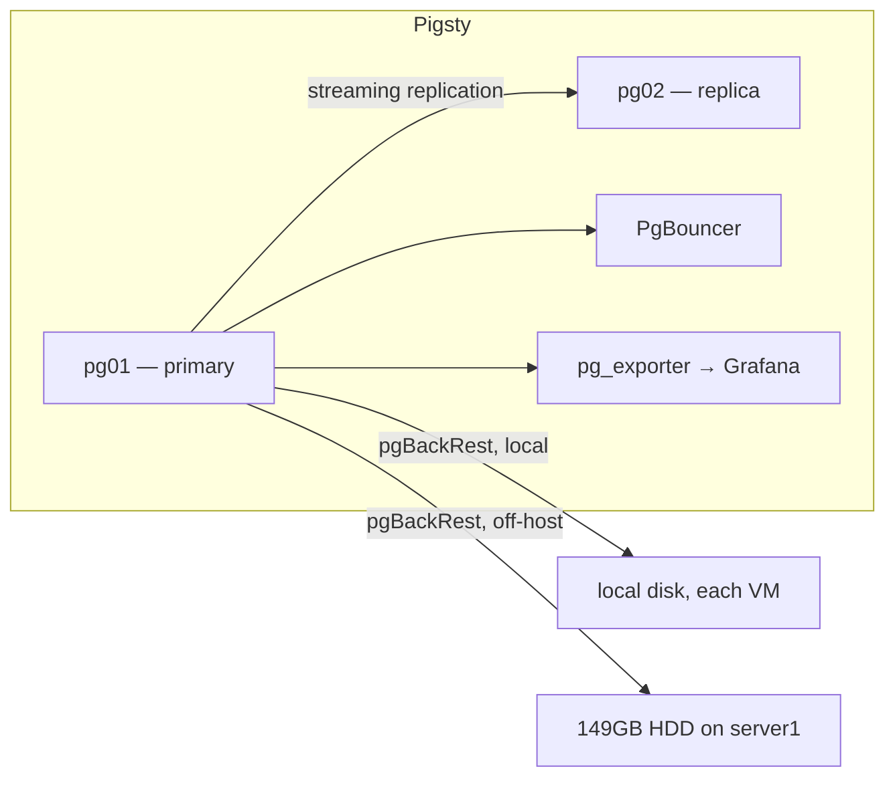
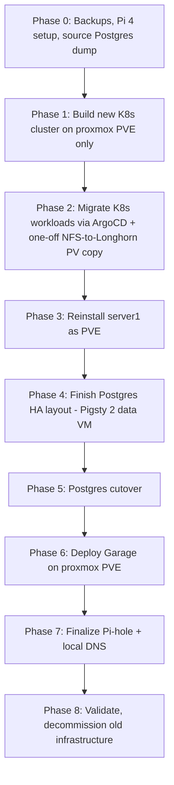

# ARCHITECTURE

Target topology and specs — the **WHAT** — for the `ukubi` homelab
cluster. This is not a rationale doc: for *why* each choice was made,
see [`DECISION.md`](DECISION.md) and [`docs/adr/`](docs/adr/README.md).
For current *live* state (may diverge from this during migration), see
[`docs/infrastructure-actual.md`](docs/infrastructure-actual.md). For
how to actually run a layer day-to-day, see its component README
(`terraform/`, `gitops/`, `ansible/`, `inventory/ukubi/`).

---

## System at a glance



---

## 1. Physical Hosts

| Host | IP | Target OS | Role |
| --- | --- | --- | --- |
| **proxmox** (bnei) | 192.168.1.165 | PVE 9.2.3 (keep) | Primary PVE host: K8s VMs + Postgres VMs + Garage LXC |
| **server1** | 192.168.1.200 | PVE 9.2 (reinstall pending) | PVE host: future K8s/PG placement |
| **ex-laptop** | 192.168.1.161 | PVE 9.2 (reinstall pending) | 3rd PVE node, sleep-risk mitigation open ([ADR-0013](docs/adr/0013-pve-node-161-sleep-risk-mitigation.md)) |
| **Pi 4** | 192.168.1.55 | Debian 13 trixie (fresh) | Pi-hole / local DNS helper |

### proxmox PVE (192.168.1.165) — 32GB RAM, 12 threads, 2× NVMe 1TB

| VM/LXC | Type | vCPU | RAM | Disk | Notes |
| --- | --- | --- | --- | --- | --- |
| pg01 | VM (Q35, OVMF) | 2 | 4GB | 40GB | Pigsty PG primary, `192.168.1.205` |
| k8s-cp-01 | VM (Q35, OVMF) | 2 | 4GB | 40GB | Control plane + etcd + worker, Ubuntu 24.04 |
| k8s-worker-gpu | VM (Q35, OVMF) | 6 | 15GB | 100GB | RTX 2070 SUPER PCIe passthrough |
| k8s-worker-01 | VM (Q35, OVMF) | 4 | 8GB | 60GB | Ubuntu 24.04 |
| garage-storage | LXC | 2 | 2GB | 200GB | S3-compatible, NVMe-backed |

Full eBPF hardware support (AMD Ryzen). ~3GB PVE overhead reserved.

### server1 PVE (192.168.1.200, after reinstall) — 32GB RAM, 6 threads, NVMe 476GB + HDD 149GB

| VM/LXC | Type | vCPU | RAM | Disk | Notes |
| --- | --- | --- | --- | --- | --- |
| pg02 | VM (Q35, OVMF) | 2 | 4GB | 40GB | Target home for the Pigsty replica after migration off `.165` |

CPU **lacks** eBPF hardware support — one reason Cilium chaining mode is
locked cluster-wide (see [ADR-0003](docs/adr/0003-cni-cilium-chaining-over-kube-proxy-replacement.md)).

### ex-laptop PVE (192.168.1.161, after reinstall) — 15GB RAM, 4 threads, SSD 238GB

| VM/LXC | Type | vCPU | RAM | Disk | Notes |
| --- | --- | --- | --- | --- | --- |
| k8s burst/utility node | VM (Q35, OVMF) | TBD | TBD | TBD | Optional future placement, subject to sleep-risk mitigation |

Treat as lower-trust capacity until suspend behavior is hardened
([ADR-0013](docs/adr/0013-pve-node-161-sleep-risk-mitigation.md)).

### Pi 4 (192.168.1.55) — fresh Debian 13 install, 1.8GB RAM, 4 cores, microSD 238GB

| Service | Notes |
| --- | --- |
| Pi-hole | Local DNS, authoritative for `*.bnei.lan`, ~50MB RAM |
| node_exporter | Optional, ~10MB RAM |

Clean install — no pre-existing state to migrate (the prior failed PG18
install on this Pi 4 held no data).

---

## 2. Kubernetes Cluster

- **Cluster name:** `ukubi-cluster`. DNS domain: `cluster.local`.
- **Topology:** 1 control plane + 2 workers (single CP accepted for
  homelab scale; see [ADR-0017](docs/adr/0017-second-control-plane-member.md)
  for the open question on adding a 2nd).
- **K8s version:** v1.35.4. **Container runtime:** containerd.
- **CNI:** Cilium, chaining mode, kube-proxy retained (`ipvs`,
  `kube_proxy_strict_arp: true`) — see [ADR-0003](docs/adr/0003-cni-cilium-chaining-over-kube-proxy-replacement.md).
- **OS:** Ubuntu 24.04 cloud-init, template VMID 9001, user `core`.

### Nodes (target)

| Node | Host | IP | Resources | Notes |
| --- | --- | --- | --- | --- |
| k8s-cp-01 | proxmox | 192.168.1.201 | 2 vCPU / 4GB | Control plane (sole) |
| k8s-worker-01 | proxmox | 192.168.1.202 | 4 vCPU / 8GB | Standard workloads |
| k8s-worker-gpu | proxmox | 192.168.1.203 | 6 vCPU / 15GB | GPU passthrough, NVIDIA device plugin |

### GPU passthrough

RTX 2070 SUPER at PCI `0b:00.0`, all 4 functions passed with
`multifunction=on` (GPU + Audio + USB + USB-C). NVIDIA driver + container
toolkit inside the VM; NVIDIA Device Plugin via Helm; GPU workloads
scheduled via taints/tolerations.

### App stack

The deployed app list is **not** duplicated here — it changes
independently of cluster architecture. See
[`gitops/apps/registry.yaml`](gitops/apps/registry.yaml), the live
source of truth per GitOps Pattern C ([ADR-0004](docs/adr/0004-gitops-pattern-c-registry-applicationset.md)).

### CNI chaining relationship



---

## 3. Networking

### Topology

- Single flat LAN `192.168.1.0/24` (Freebox has no VLANs).
- Gateway: Freebox `192.168.1.254`.
- IP allocation by role, not subnet: `.1` Freebox · `.20-.49` hosts ·
  `.50-.99` static infra · `.100-.199` VMs/LXCs · `.200-.254` Freebox DHCP.
- Bridge: `vmbr0` on each PVE host, no NAT, no internal libvirt network.

### MetalLB

- **Mode:** L2 only (Freebox blocks BGP — see `DECISION.md` §2).
- **IP range:** `192.168.1.230-192.168.1.250`. **Reserved ingress VIP:** `.230`.
- **Speaker:** tolerates `node-role.kubernetes.io/control-plane:NoSchedule`.
- **Controller:** 2 replicas, pod anti-affinity keyed on
  `app=metallb,component=controller` / `topologyKey=kubernetes.io/hostname`.

### DNS (target records)

```text
A    proxmox.bnei.lan        → 192.168.1.165
A    server1.bnei.lan        → 192.168.1.200
A    pi4.bnei.lan            → 192.168.1.55
A    postgres-1.bnei.lan     → 192.168.1.205
A    postgres-2.bnei.lan     → <assigned after server1 rejoin>
A    garage.bnei.lan         → <assigned>
A    k8s.bnei.lan            → 192.168.1.180  (reserved, see ADR-0016)
A    *.bnei.dev              → public IP / router port-forward
```

Endpoint naming (`k8s-proxmox-gpu.bnei.lan` vs `k8s.bnei.lan`) is still
open — see [ADR-0016](docs/adr/0016-k8s-endpoint-naming.md).

---

## 4. Ingress & TLS

**WHAT:** Traefik in-cluster (Helm + ArgoCD), Service `LoadBalancer` via
MetalLB, `IngressRoute` for all app HTTPS routing, native ACME HTTP-01,
`acme.json` on a PVC (RWX or `replicas: 1`, never `emptyDir`).

Why (Gateway API reversal, cert-manager/DNS-01 rejections): see
[ADR-0001](docs/adr/0001-ingress-traefik-ingressroute-over-gateway-api.md).



---

## 5. GitOps / ArgoCD

**WHAT:** ArgoCD (Helm-installed, not a kubespray addon — see
[ADR-0005](docs/adr/0005-argocd-install-helm-not-kubespray-addon.md)),
Pattern C app delivery ([ADR-0004](docs/adr/0004-gitops-pattern-c-registry-applicationset.md)).
Full operational detail — bootstrap sequence, wave ordering, credential
chain, how to add an app — lives in [`gitops/README.md`](gitops/README.md),
not repeated here.



---

## 6. Database / Pigsty

- **Stack:** PostgreSQL + Pigsty (primary/replica + PgBouncer + pgBackRest).
- **Topology:** 2 data VM nodes, primary/replica. No witness node, no
  automatic failover (see `DECISION.md` §2).

| Node | Host | Role |
| --- | --- | --- |
| pg01 | proxmox PVE | Primary — `192.168.1.205` |
| pg02 | server1 PVE (currently on `.165`, temporary) | Replica |

Redis is currently co-located on pg02. Migration from the original
source (`.193`, PG 16.4) is complete; source VM decommissioned.



**Backups:** 7 daily / 4 weekly / 3 monthly, PITR 7 days — see §10 below
for the full backup matrix across all data types.

---

## 7. Storage

### Longhorn (K8s app PVs)

Default StorageClass, in-cluster, distributed across each K8s VM's
dedicated `scsi1` disk. Replica count 3 (chart default). Postgres is
**not** on Longhorn — local on each data VM. Why Longhorn over
Ceph/NFS: [ADR-0002](docs/adr/0002-storage-longhorn-over-ceph-nfs.md).
Rollout specifics (sizing, replica count on `k8s-cp-01`,
`local-path-provisioner` fate) are still open: [ADR-0019](docs/adr/0019-longhorn-rollout-specifics.md).

### Garage (object storage)

LXC on proxmox PVE, NVMe-backed, 200GB allocated, S3-compatible API at
`s3.bnei.dev` via Traefik. Single node initially, can scale to 2-3 nodes
later. Replaces MinIO (archived Jan 2026).

### Proxmox storage

- `local` (directory): unchanged.
- `local-lvm` (LVM-thin): VM disks, thin-provisioned.
- ZFS pool vs `local-zfs` directory for new storage: open, see
  [ADR-0014](docs/adr/0014-pve-storage-layout-zfs-vs-local-zfs.md).

### Backup target

149GB HDD on server1 (replaces the dead Ceph OSD it used to serve).

---

## 8. Identity & Access

### Proxmox

API tokens per host (exists for proxmox; new token needed for server1
after PVE install).

### SSH

Per-host keys for each VM/LXC. Bastion pattern: hermesagent LXC → all
hosts/VMs.

### K8s

New service accounts per app; Infisical for app secrets.

### TLS

Wildcard cert `*.bnei.dev` via Traefik ACME HTTP-01 (§4 above).

> **Flag:** an earlier draft of this section proposed "internal certs
> via internal CA (for Postgres, etcd, etc.)". That needs reconciling
> against [ADR-0006](docs/adr/0006-reject-infisical-as-ssh-tls-ca.md)
> (Infisical rejected as a CA) — it isn't necessarily the same proposal
> (a non-Infisical internal CA wasn't explicitly ruled out), but it was
> never resolved. Treat as an open question, not a locked decision,
> until a fresh ADR settles it.

---

## 9. Observability

- Prometheus + Grafana in K8s (existing).
- pg_exporter on Postgres (via Pigsty).
- node_exporter on every host (Pi 4, ex-laptop, PVE hosts).
- Hubble for Cilium L3/L4 observability.
- Loki + Promtail for centralized logging (under consideration, not
  yet committed).
- Alertmanager for critical alerts (Postgres down, disk full, etc.).

---

## 10. Backup Strategy

| Data | Method | Target | Frequency | Retention |
| --- | --- | --- | --- | --- |
| Postgres (full + WAL) | pgBackRest | local + 149GB HDD on server1 | daily + continuous WAL | 7d / 4w / 3m |
| K8s manifests | Git | `github.com/MohammadBnei/k8s-cluster` | on commit | indefinite |
| K8s PVs | Longhorn snapshots (+ Velero if added) | Garage (S3) | daily | 7 daily |
| Proxmox config | cron + tar | NFS or backup HDD | daily | 7 daily |
| Pi-hole config | restic | NFS or backup HDD | daily | 7 daily |
| `/home/mohammad` | restic | NFS or backup HDD | daily | 7 daily |

Backup verification: monthly restore test to a sandbox VM.

---

## 11. Migration Path

Full phased plan (execution detail lives in `docs/bootstrap-test-notes.md`
and the runbooks under `docs/`, most still TODO):



---

*This document is design intent. Actual state may diverge temporarily
during migration — see `docs/infrastructure-actual.md`. Update both
this file and `infrastructure-actual.md` when real changes land.*
