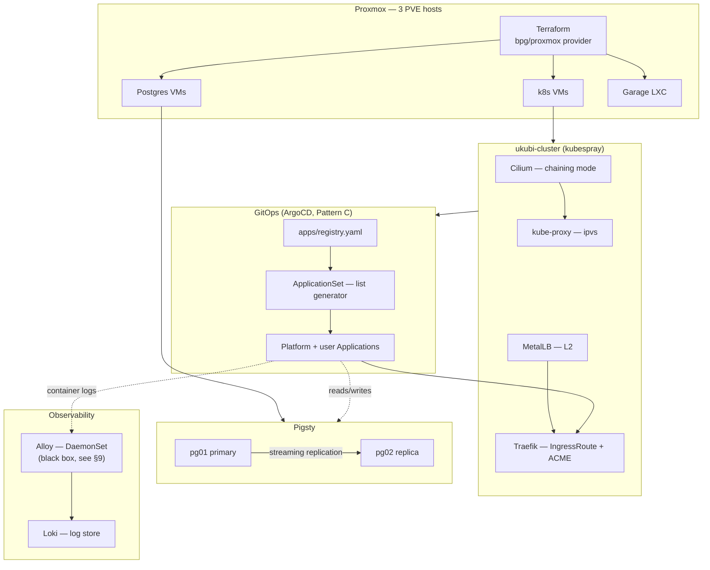
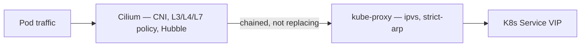
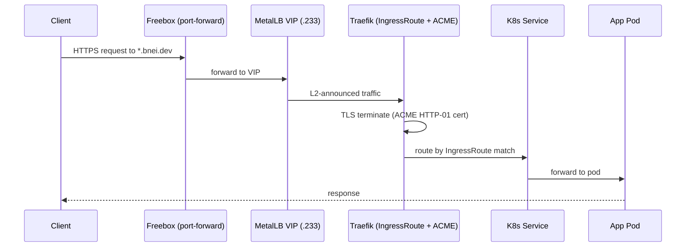
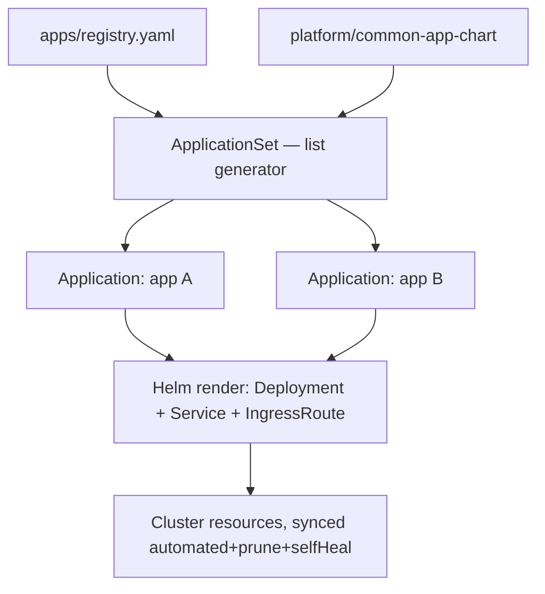
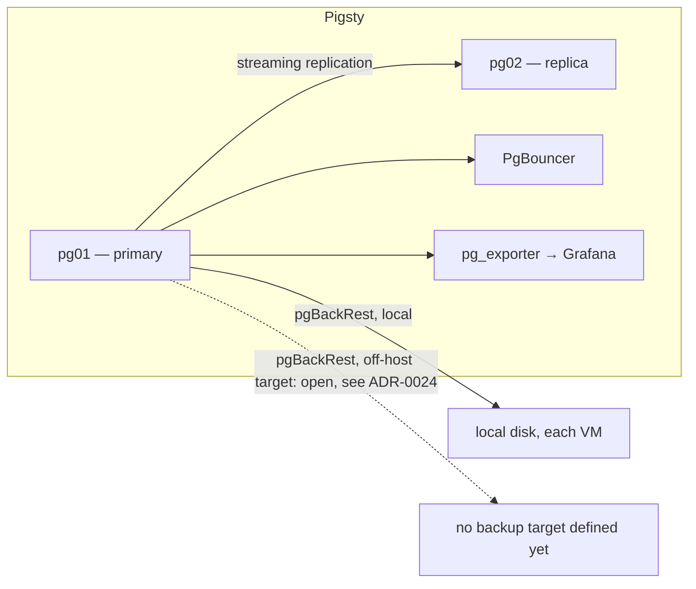
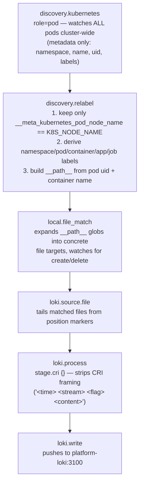
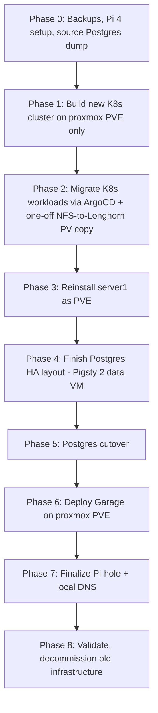

# ARCHITECTURE

Target topology and specs — the **WHAT** — for the `ukubi` homelab
cluster. This is not a rationale doc: for *why* each choice was made,
see [`DECISION.md`](DECISION.md) and [`docs/adr/`](docs/adr/README.md).
For current *live* state (may diverge from this during migration), see
[`docs/infrastructure-actual.md`](docs/infrastructure-actual.md). For
how to actually run a layer day-to-day, see its component README
(`terraform/`, `gitops/`, `ansible/`, `inventory/ukubi/`).

---

## System at a glance


```mermaid
graph TD
    subgraph Proxmox["Proxmox — 3 PVE hosts"]
        TF[Terraform<br/>bpg/proxmox provider]
        VM1[k8s VMs]
        VM2[Postgres VMs]
        VM3[Garage LXC]
        TF --> VM1
        TF --> VM2
        TF --> VM3
    end

    subgraph K8s["ukubi-cluster (kubespray)"]
        Cilium[Cilium — chaining mode]
        KP[kube-proxy — ipvs]
        MetalLB[MetalLB — L2]
        Traefik[Traefik — IngressRoute + ACME]
        Cilium --> KP
        MetalLB --> Traefik
    end

    subgraph GitOps["GitOps (ArgoCD, Pattern C)"]
        Registry[apps/registry.yaml]
        AppSet[ApplicationSet — list generator]
        Apps[Platform + user Applications]
        Registry --> AppSet --> Apps
    end

    subgraph Pigsty["Pigsty"]
        PG1[pg01 primary]
        PG2[pg02 replica]
        PG1 -- streaming replication --> PG2
    end

    subgraph Obs["Observability"]
        Alloy["Alloy — DaemonSet<br/>(black box, see §9)"]
        Loki[Loki — log store]
        Alloy --> Loki
    end

    VM1 --> K8s
    Apps --> Traefik
    K8s --> GitOps
    VM2 --> Pigsty
    Apps -. reads/writes .-> Pigsty
    Apps -. container logs .-> Alloy
```

---

## 1. Physical Hosts

| Host | IP | Target OS | Role |
| --- | --- | --- | --- |
| **proxmox** (bnei) | 192.168.1.165 | PVE 9.2.3 (keep) | Primary PVE host: K8s VMs + Postgres VMs + Garage LXC |
| **server1** | 192.168.1.200 | PVE 9.2 (reinstalled, joined corosync cluster) | PVE host: future K8s/PG placement |
| **ex-laptop** | 192.168.1.161 | PVE 9.2 (reinstalled, joined corosync cluster) | 3rd PVE node, sleep-risk mitigation open ([ADR-0013](docs/adr/0013-pve-node-161-sleep-risk-mitigation.md)) |
| **Pi 4** | 192.168.1.55 | Debian 13 trixie (fresh) | Pi-hole / local DNS helper |

### proxmox PVE (192.168.1.165) — 32GB RAM, 12 threads, 2× NVMe 1TB

| VM/LXC | Type | vCPU | RAM | Disk | Notes |
| --- | --- | --- | --- | --- | --- |
| pg01 | VM (Q35, OVMF) | 2 | 4GB | 40GB | Pigsty PG primary, `192.168.1.205` |
| k8s-cp-01 | VM (Q35, OVMF) | 2 | 4GB | 40GB | Control plane + etcd + worker, Ubuntu 24.04 |
| k8s-worker-01 | VM (Q35, OVMF) | 6 | 15GB | 100GB | Ubuntu 24.04, RTX 2070 SUPER PCIe passthrough |
| garage-storage | LXC | 2 | 2GB | 200GB | S3-compatible, NVMe-backed |

Full eBPF hardware support (AMD Ryzen). ~3GB PVE overhead reserved.

### server1 PVE (192.168.1.200, reinstalled) — 32GB RAM, 6 threads, NVMe 476GB (149GB HDD removed pre-reinstall, ext4 root + `local-lvm`, no dedicated ZFS pool — [ADR-0024](docs/adr/0024-server1-single-disk-ext4-no-dedicated-zfs.md))

| VM/LXC | Type | vCPU | RAM | Disk | Notes |
| --- | --- | --- | --- | --- | --- |
| pg02 | VM (Q35, OVMF) | 2 | 4GB | 40GB | Target home for the Pigsty replica after migration off `.165` |
| nfs-storage | VM (Q35, OVMF) | 1 | 1GB | 120GB | Shared PVE storage for cross-host VM template cloning — [ADR-0026](docs/adr/0026-nfs-shared-pve-storage-cross-host-clone.md), never mounted by K8s |
| k8s-worker-02 | VM (Q35, OVMF) | 6 | 16GB | 60GB | First cross-host K8s worker (Stage 2 Phase C), `192.168.1.203` — resized 4→6 vCPU/8→16GB 2026-07-30, server1 had most of its RAM idle |
| k8s-cp-02 | VM (Q35, OVMF) | 2 | 4GB | 40GB | 2nd control-plane + etcd member, `192.168.1.204` — [ADR-0017](docs/adr/0017-second-control-plane-member.md) |

CPU **lacks** eBPF hardware support — one reason Cilium chaining mode is
locked cluster-wide (see [ADR-0003](docs/adr/0003-cni-cilium-chaining-over-kube-proxy-replacement.md)).

### ex-laptop PVE (192.168.1.161, after reinstall) — 15GB RAM, 4 threads, SSD 238GB, `local-lvm` only ([ADR-0028](docs/adr/0028-ex-laptop-no-dedicated-zfs-pool.md) — no dedicated ZFS pool)

| VM/LXC | Type | vCPU | RAM | Disk | Notes |
| --- | --- | --- | --- | --- | --- |
| k8s-cp-03 | VM (Q35, OVMF) | 2 | 4GB | 40GB | 3rd control-plane + etcd member, `192.168.1.206` — [ADR-0017](docs/adr/0017-second-control-plane-member.md) |

Sleep-risk mitigation applied and confirmed ([ADR-0013](docs/adr/0013-pve-node-161-sleep-risk-mitigation.md)) — still deliberately kept a
*minority* etcd/CP voter (not the majority), so losing this host never
costs quorum even though it's the least-trusted of the 3.

### Pi 4 (192.168.1.55) — fresh Debian 13 install, 1.8GB RAM, 4 cores, microSD 238GB

| Service | Notes |
| --- | --- |
| Pi-hole | Static IP (pinned via `nmcli`, was DHCP-dynamic), authoritative for `bnei.lan`, ~50MB RAM — see §3 DNS below |
| node_exporter | Optional, ~10MB RAM |

Clean install — no pre-existing state to migrate (the prior failed PG18
install on this Pi 4 held no data).

---

## 2. Kubernetes Cluster

- **Cluster name:** `ukubi-cluster`. DNS domain: `cluster.local`.
- **Topology:** 3 control-plane/etcd members, live and joined
  2026-07-30 ([ADR-0017](docs/adr/0017-second-control-plane-member.md)) —
  deliberately **not** 2 (etcd quorum at N=2 is still 2, strictly worse
  than 1 member). Placement is the whole point: 2 members on the stable
  hosts (server1, ex-laptop), `k8s-cp-01` (`.165`, the host that gets
  rebooted for gaming) kept a minority voter, so losing it never costs
  quorum. Fronted by a kube-vip VIP, `192.168.1.180`/`k8s.bnei.lan` —
  [ADR-0016](docs/adr/0016-k8s-endpoint-naming.md), confirmed live (API
  server cert SANs carry both, `kubectl` against the VIP works). The
  worker carries the GPU passthrough directly — no separate
  `k8s-worker-gpu` VM.
- **K8s version:** v1.35.4. **Container runtime:** containerd.
- **CNI:** Cilium, chaining mode, kube-proxy retained (`ipvs`,
  `kube_proxy_strict_arp: true`) — see [ADR-0003](docs/adr/0003-cni-cilium-chaining-over-kube-proxy-replacement.md).
- **OS:** Ubuntu 24.04 cloud-init, template VMID 9001, user `core`.

### Nodes (current — confirmed live 2026-07-30 via `kubectl get nodes`)

| Node | Host | IP | Resources | Notes |
| --- | --- | --- | --- | --- |
| k8s-cp-01 | `.165` | 192.168.1.201 | 2 vCPU / 4GB | Control plane + etcd (minority voter) |
| k8s-cp-02 | server1 | 192.168.1.204 | 2 vCPU / 4GB | Control plane + etcd |
| k8s-cp-03 | ex-laptop | 192.168.1.206 | 2 vCPU / 4GB | Control plane + etcd |
| k8s-worker-01 | `.165` | 192.168.1.202 | 6 vCPU / 15GB | Standard workloads + GPU passthrough, NVIDIA device plugin |
| k8s-worker-02 | server1 | 192.168.1.203 | 6 vCPU / 16GB | Standard workloads, first cross-host worker (Stage 2 Phase C) |

### GPU passthrough

RTX 2070 SUPER at PCI `0b:00.0`, all 4 functions passed with
`multifunction=on` (GPU + Audio + USB + USB-C). NVIDIA driver + container
toolkit inside the VM; NVIDIA Device Plugin via Helm; GPU workloads
scheduled via taints/tolerations.

### App stack

The deployed app list is **not** duplicated here — it changes
independently of cluster architecture. See
[`gitops/apps/registry.yaml`](gitops/apps/registry.yaml), the live
source of truth per GitOps Pattern C ([ADR-0004](docs/adr/0004-gitops-pattern-c-registry-applicationset.md)).

### CNI chaining relationship


```mermaid
graph LR
    Pod[Pod traffic] --> Cilium[Cilium — CNI, L3/L4/L7 policy, Hubble]
    Cilium -- chained, not replacing --> KubeProxy[kube-proxy — ipvs, strict-arp]
    KubeProxy --> Service[K8s Service VIP]
```

---

## 3. Networking

### Topology

- Single flat LAN `192.168.1.0/24` (Freebox has no VLANs).
- Gateway: Freebox `192.168.1.254`.
- IP allocation by role, not subnet: `.1` Freebox · `.20-.49` hosts ·
  `.50-.99` static infra · `.100-.199` VMs/LXCs · `.200-.254` Freebox DHCP.
- Bridge: `vmbr0` on each PVE host, no NAT, no internal libvirt network.

### MetalLB

- **Mode:** L2 only (Freebox blocks BGP — see `DECISION.md` §2).
- **IP range:** `192.168.1.233-192.168.1.250`. **Reserved ingress VIP:**
  `.233` (pinned via `metallb.universe.tf/loadBalancerIPs` on Traefik's
  Service). `.230-.232` excluded from the pool — `.232` is Pigsty's HA
  floating VIP (vip-manager), `.230`/`.231` kept clear alongside it.
- **Speaker:** tolerates `node-role.kubernetes.io/control-plane:NoSchedule`.
- **Controller:** 2 replicas, pod anti-affinity keyed on
  `app=metallb,component=controller` / `topologyKey=kubernetes.io/hostname`.

### DNS

**Authority:** Pi-hole on the Pi 4 (`192.168.1.55`,
`ansible/playbooks/pihole-configure.yml`), authoritative for `bnei.lan`
per `DECISION.md` §2. Triggered once there were enough real internal
hostnames (kube-vip's endpoint, the pg/garage/nfs/k9s-dashboard VMs) that
raw IPs stopped being convenient. `bnei.dev` stays external via
Cloudflare, unrelated to this.

**Static IP:** Pi-hole's own address is pinned via `nmcli` (was
DHCP-dynamic — a real risk once other things depend on it staying put),
self-contained on the Pi rather than a Freebox DHCP reservation.

**Two separate consumers, deliberately configured differently:**
- **The LAN generally** (PVE hosts, laptops, phones) — inherits DNS from
  whatever the Freebox hands out. Pointing the Freebox itself at Pi-hole
  (as its own upstream and/or the DHCP-advertised server) is the
  low-effort, high-coverage fix for this tier — one-time change, covers
  every device including ones added later, operator-applied (not
  automatable from this repo).
- **The K8s cluster's CoreDNS** — forwards upstream via
  `upstream_dns_servers` (`inventory/ukubi/group_vars/all/settings.yml`):
  Pi-hole first, `1.1.1.1` as fallback. Set **explicitly** rather than
  inherited from the node's own resolv.conf/Freebox — DB connectivity
  (pods resolving the Pigsty VIP by name) depends on this, not worth an
  extra Freebox-relay hop for something this critical. Confirmed live via
  a `cluster.yml` re-run after the 3-CP join.

### Records

```text
A    proxmox.bnei.lan        → 192.168.1.165
A    server1.bnei.lan        → 192.168.1.200
A    ex-laptop.bnei.lan      → 192.168.1.161
A    pi4.bnei.lan            → 192.168.1.55
A    postgres-1.bnei.lan     → 192.168.1.205  (pg01 VM — Patroni role can differ from this name, see ADR-0017/patronictl)
A    postgres-2.bnei.lan     → 192.168.1.207  (pg02 VM — both still on .165 pending the HA migration, ADR-0017)
A    postgres.bnei.lan       → 192.168.1.232  (Pigsty HA floating VIP — apps/tests should use this, not postgres-1/2 directly)
A    garage.bnei.lan         → 192.168.1.199
A    nfs-storage.bnei.lan    → 192.168.1.198
A    k9s-dashboard.bnei.lan  → 192.168.1.110
A    k8s.bnei.lan            → 192.168.1.180  (kube-vip control-plane VIP, confirmed live — see ADR-0016)
A    k8s-cp-01.bnei.lan      → 192.168.1.201
A    k8s-cp-02.bnei.lan      → 192.168.1.204
A    k8s-cp-03.bnei.lan      → 192.168.1.206
A    k8s-worker-01.bnei.lan  → 192.168.1.202
A    k8s-worker-02.bnei.lan  → 192.168.1.203
A    *.bnei.dev              → public IP / router port-forward
```

Endpoint naming (`k8s-proxmox-gpu.bnei.lan` vs `k8s.bnei.lan`) is resolved
in favor of `k8s.bnei.lan` — see
[ADR-0016](docs/adr/0016-k8s-endpoint-naming.md). This list is declared,
reconciled-every-run state (`pihole_hosts_records` in
`ansible/playbooks/pihole-configure.yml`) — add a line there (and here)
as each new host is actually provisioned, never speculatively.

---

## 4. Ingress & TLS

**WHAT:** Traefik in-cluster (Helm + ArgoCD), Service `LoadBalancer` via
MetalLB, `IngressRoute` for all app HTTPS routing, native ACME HTTP-01,
`acme.json` on a PVC (RWX or `replicas: 1`, never `emptyDir`).

Why (Gateway API reversal, cert-manager/DNS-01 rejections): see
[ADR-0001](docs/adr/0001-ingress-traefik-ingressroute-over-gateway-api.md).


```mermaid
sequenceDiagram
    participant C as Client
    participant FB as Freebox (port-forward)
    participant MLB as MetalLB VIP (.233)
    participant TR as Traefik (IngressRoute + ACME)
    participant SVC as K8s Service
    participant POD as App Pod

    C->>FB: HTTPS request to *.bnei.dev
    FB->>MLB: forward to VIP
    MLB->>TR: L2-announced traffic
    TR->>TR: TLS terminate (ACME HTTP-01 cert)
    TR->>SVC: route by IngressRoute match
    SVC->>POD: forward to pod
    POD-->>C: response
```

---

## 5. GitOps / ArgoCD

**WHAT:** ArgoCD (Helm-installed, not a kubespray addon — see
[ADR-0005](docs/adr/0005-argocd-install-helm-not-kubespray-addon.md)),
Pattern C app delivery ([ADR-0004](docs/adr/0004-gitops-pattern-c-registry-applicationset.md)).
Full operational detail — bootstrap sequence, wave ordering, credential
chain, how to add an app — lives in [`gitops/README.md`](gitops/README.md),
not repeated here.


```mermaid
graph TD
    Registry[apps/registry.yaml] --> AppSet[ApplicationSet — list generator]
    Chart[platform/common-app-chart] --> AppSet
    AppSet --> App1[Application: app A]
    AppSet --> App2[Application: app B]
    App1 --> Render[Helm render: Deployment + Service + IngressRoute]
    App2 --> Render
    Render --> Cluster[Cluster resources, synced automated+prune+selfHeal]
```

**CI/CD:** a self-hosted GitHub Actions runner (`myoung34/github-runner`)
runs in-cluster as its own standalone Application
(`gitops/bootstrap/actions-runner-application.yaml`,
`gitops/platform/actions-runner/`) — GitHub-hosted runners can't reach the
cluster's LAN-only K8s API, and a VPN was already rejected (ADR-0009). RBAC
is scoped per-namespace (`vos`/`vos-dev` today), never cluster-wide. It's
the execution target for `common-app-chart`'s `hooks:`/`oneOffJobs:`
(ArgoCD sync hooks + a ledger-driven reusable workflow for one-time
scripts — ADR-0022 / ADR-0023).

---

## 6. Database / Pigsty

- **Stack:** PostgreSQL + Pigsty (primary/replica + PgBouncer + pgBackRest).
- **Topology:** 2 data VM nodes, primary/replica. No witness node, no
  automatic failover (see `DECISION.md` §2).

| Node | Host | Role |
| --- | --- | --- |
| pg01 | proxmox PVE | Primary — `192.168.1.205` |
| pg02 | server1 PVE (currently on `.165`, temporary) | Replica |

Redis is currently co-located on pg02. Migration from the original
source (`.193`, PG 16.4) is complete; source VM decommissioned.


```mermaid
graph LR
    subgraph Pigsty
        P1[pg01 — primary] -- streaming replication --> P2[pg02 — replica]
        P1 --> Bouncer[PgBouncer]
        P1 --> Exporter[pg_exporter → Grafana]
    end
    P1 -- pgBackRest, local --> LocalBackup[local disk, each VM]
    P1 -.->|pgBackRest, off-host target: open, see ADR-0024| Open[no backup target defined yet]
```

**Backups:** 7 daily / 4 weekly / 3 monthly, PITR 7 days — see §10 below
for the full backup matrix across all data types.

---

## 7. Storage

### Longhorn (K8s app PVs)

Default StorageClass, in-cluster, distributed across each K8s VM's
dedicated `scsi1` disk. Replica count 3 (chart default) — was degraded
(2/3) with only `k8s-cp-01`/`k8s-worker-01` schedulable; now 5 nodes are
schedulable (`k8s-cp-01/02/03`, `k8s-worker-01/02`, all `worker: true`
per `terraform/variables.tf`'s `k8s_nodes` map), so full 3/3 replication
is achievable — not yet re-verified live post-join (check
`kubectl get volumes.longhorn.io -A` before relying on this). Postgres is **not** on
Longhorn — local on each data VM. Why Longhorn over Ceph/NFS:
[ADR-0002](docs/adr/0002-storage-longhorn-over-ceph-nfs.md). Rollout
specifics (sizing, replica count on `k8s-cp-01`, `local-path-provisioner`
fate, backup target): [ADR-0019](docs/adr/0019-longhorn-rollout-specifics.md)
(Accepted).

### Garage (object storage)

LXC on proxmox PVE, NVMe-backed, 200GB allocated, S3-compatible API at
`s3.bnei.dev` via Traefik. Single node initially, can scale to 2-3 nodes
later. Replaces MinIO (archived Jan 2026).

### Proxmox storage

- `local` (directory): unchanged.
- `local-lvm` (LVM-thin): VM disks, thin-provisioned.
- ZFS pool vs `local-zfs` directory for new storage: open, see
  [ADR-0014](docs/adr/0014-pve-storage-layout-zfs-vs-local-zfs.md).
- `shared-templates` (NFS, hosted on the `nfs-storage` VM on `server1`):
  cluster-wide shared storage for the golden K8s template's disk +
  cloud-init vendor-data, so Terraform's cross-host VM cloning takes a
  direct-clone path instead of clone-then-migrate — see
  [ADR-0026](docs/adr/0026-nfs-shared-pve-storage-cross-host-clone.md).
  Scoped strictly to PVE-internal VM template storage, **not** mounted
  into K8s (that's Longhorn, above) — a different problem from the NFS
  server ADR-0002 already rejected for K8s app PVs.

### Backup target

Open — the 149GB HDD on server1 that was slated to replace the dead Ceph
OSD was physically removed before server1's reinstall
([ADR-0024](docs/adr/0024-server1-single-disk-ext4-no-dedicated-zfs.md)).
No backup target is defined until this is revisited.

---

## 8. Identity & Access

### Proxmox

API tokens per host (exists for proxmox; new token needed for server1
after PVE install).

### SSH

Per-host keys for each VM/LXC. Bastion pattern: hermesagent LXC → all
hosts/VMs.

### K8s

New service accounts per app; Infisical for app secrets.

### TLS

Wildcard cert `*.bnei.dev` via Traefik ACME HTTP-01 (§4 above).

> **Flag:** an earlier draft of this section proposed "internal certs
> via internal CA (for Postgres, etcd, etc.)". That needs reconciling
> against [ADR-0006](docs/adr/0006-reject-infisical-as-ssh-tls-ca.md)
> (Infisical rejected as a CA) — it isn't necessarily the same proposal
> (a non-Infisical internal CA wasn't explicitly ruled out), but it was
> never resolved. Treat as an open question, not a locked decision,
> until a fresh ADR settles it.

---

## 9. Observability

- Prometheus + Grafana in K8s (existing).
- pg_exporter on Postgres (via Pigsty).
- node_exporter on every host (Pi 4, ex-laptop, PVE hosts).
- Hubble for Cilium L3/L4 observability.
- Loki + Grafana Alloy for centralized logging (implemented — Loki
  SingleBinary mode with filesystem storage, Alloy DaemonSet shipping
  container logs from every node; Alloy chosen over Promtail since it's
  Grafana's OTel-Collector-based agent, needed anyway for planned OTLP
  traces/metrics — see [ADR-0027](docs/adr/0027-logging-loki-alloy-over-clickhouse-promtail.md)).
  A first Grafana-native alert rule (log error-rate spike, routed to
  Discord) exists as a starting point — see
  `gitops/platform/values/grafana/values.yaml`'s `alerting:` key; more
  targeted rules still need to be authored. Grafana's "App Logs" dashboard
  gives namespace/level/text-search filtering over Loki. User apps can
  declare their own log alert rules from their own repo via
  `common-app-chart`'s `logAlerts:` values block (picked up dynamically by
  Grafana's alerts sidecar) — no platform-repo edit needed per app.
- Alertmanager for critical alerts, routed to a Discord channel webhook via
  its native `slack_configs` receiver (see
  `gitops/platform/values/prometheus/values.yaml`). Postgres-down/disk-full
  rules still need to be authored — the receiver/route plumbing is what's
  implemented so far.

### Whitebox: Alloy's log-tailing pipeline

The "Alloy" box in the diagram above is a DaemonSet — one pod per node,
config in `gitops/platform/values/alloy/values.yaml`. Internally it's a
5-stage pipeline, entirely file-based (no Kubernetes API calls to read log
content — only to read pod *metadata*):


```mermaid
graph TD
    DK["discovery.kubernetes<br/>role=pod — watches ALL pods cluster-wide<br/>(metadata only: namespace, name, uid, labels)"]
    DR["discovery.relabel<br/>1. keep only __meta_kubernetes_pod_node_name == K8S_NODE_NAME<br/>2. derive namespace/pod/container/app/job labels<br/>3. build __path__ from pod uid + container name"]
    LFM["local.file_match<br/>expands __path__ globs into concrete<br/>file targets, watches for create/delete"]
    LSF["loki.source.file<br/>tails matched files from position markers"]
    LP["loki.process<br/>stage.cri {} — strips CRI framing<br/>('&lt;time&gt; &lt;stream&gt; &lt;flag&gt; &lt;content&gt;')"]
    LW["loki.write<br/>pushes to platform-loki:3100"]

    DK --> DR --> LFM --> LSF --> LP --> LW
```

Why this shape, in order:

1. **Node-local filtering first** (`discovery.relabel` step 1). Every
   Alloy pod's `discovery.kubernetes` sees every pod in the cluster, but a
   given node can only read log files that physically exist on its own
   disk — so each Alloy instance immediately drops every target that
   isn't scheduled locally, using `K8S_NODE_NAME` (injected by the Alloy
   chart itself into every pod, not a value this repo sets) matched
   against `__meta_kubernetes_pod_node_name`.
2. **Path construction, not API lookup** (`discovery.relabel` step 3).
   kubelet writes container logs to a fixed, predictable path for every
   pod on containerd:
   `/var/log/pods/<namespace>_<pod-name>_<pod-uid>/<container>/*.log`.
   Alloy reconstructs this path directly from Kubernetes metadata
   (`__meta_kubernetes_pod_uid` + `__meta_kubernetes_pod_container_name`,
   globbing the `<namespace>_<pod-name>_` prefix) rather than asking the
   API "give me this pod's logs." The whole node's `/var/log` is mounted
   into the Alloy container read-only via the chart's `alloy.mounts.varlog:
   true` (a hostPath volume) for this to be readable at all.
3. **`local.file_match` + `loki.source.file`, not `loki.source.kubernetes`.**
   This is the deliberate part: an earlier version of this pipeline used
   `loki.source.kubernetes`, which proxies log reads through the kubelet
   API instead of the filesystem. When a pod is deleted — this cluster's
   CI-driven app namespaces redeploy constantly — that component's tailer
   could leak instead of tearing down, then loop forever against a
   container containerd had already garbage-collected, forwarding the
   kubelet's literal `unable to retrieve container logs for
   containerd://<id>` error text into Loki as if it were real application
   output (see ADR-0027's 2026-07-29 update, PR #67). File-based tailing
   doesn't have this failure mode: when a pod is deleted, its log file
   simply stops existing, `local.file_match` drops the target cleanly,
   and there's no API error body to ever misinterpret as log content.
4. **`stage.cri` restores what the kubelet API used to do implicitly.**
   Raw kubelet log files are CRI-framed (`2026-07-29T11:02:04Z stdout F
   {"level":"info",...}` — timestamp, stream, partial/full flag, then the
   actual line). `loki.source.kubernetes` stripped this automatically as
   part of its API response; reading the file directly exposes it, so
   `loki.process`'s `stage.cri {}` strips it back down to the real log
   line + a `stream` label before `loki.write` pushes it to Loki.

---

## 10. Backup Strategy

| Data | Method | Target | Frequency | Retention |
| --- | --- | --- | --- | --- |
| Postgres (full + WAL) | pgBackRest | local only; off-host target open, see §7/ADR-0024 (server1's HDD was physically removed) | daily + continuous WAL | 7d / 4w / 3m |
| K8s manifests | Git | `github.com/MohammadBnei/k8s-cluster` | on commit | indefinite |
| K8s PVs | Longhorn snapshots (+ Velero if added) | Garage (S3) | daily | 7 daily |
| Proxmox config | cron + tar | open, see §7/ADR-0024 | daily | 7 daily |
| Pi-hole config | restic | open, see §7/ADR-0024 | daily | 7 daily |
| `/home/mohammad` | restic | open, see §7/ADR-0024 | daily | 7 daily |

Backup verification: monthly restore test to a sandbox VM.

---

## 11. Migration Path

Full phased plan (execution detail lives in `docs/bootstrap-test-notes.md`
and the runbooks under `docs/` — see `docs/README.md`'s status table for
which ones still remain):


```mermaid
graph TD
    P0[Phase 0: Backups, Pi 4 setup, source Postgres dump]
    P1[Phase 1: Build new K8s cluster on proxmox PVE only]
    P2[Phase 2: Migrate K8s workloads via ArgoCD + one-off NFS-to-Longhorn PV copy]
    P3[Phase 3: Reinstall server1 as PVE]
    P4[Phase 4: Finish Postgres HA layout - Pigsty 2 data VM]
    P5[Phase 5: Postgres cutover]
    P6[Phase 6: Deploy Garage on proxmox PVE]
    P7[Phase 7: Finalize Pi-hole + local DNS]
    P8[Phase 8: Validate, decommission old infrastructure]

    P0 --> P1 --> P2 --> P3 --> P4 --> P5 --> P6 --> P7 --> P8
```

---

*This document is design intent. Actual state may diverge temporarily
during migration — see `docs/infrastructure-actual.md`. Update both
this file and `infrastructure-actual.md` when real changes land.*
