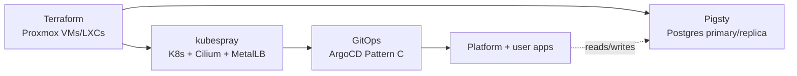

# infra-bootstrap

Bootstrap configs for the homelab `ukubi-cluster`: kubespray inventory, Pigsty config, GitOps manifests, and Ansible playbooks for PVE post-install + VM provisioning.

**Target specs (WHAT):** [`ARCHITECTURE.md`](ARCHITECTURE.md)
**Decisions & rationale (WHY):** [`DECISION.md`](DECISION.md) + [`docs/adr/`](docs/adr/README.md)
**Current live state:** [`docs/infrastructure-actual.md`](docs/infrastructure-actual.md)
**Runtime K8s manifests:** [`MohammadBnei/k8s-cluster`](https://github.com/MohammadBnei/k8s-cluster) (separate repo, GitOps via ArgoCD)

---

## System at a glance



Five moving parts, one at a time:

1. **Terraform** provisions Proxmox VMs/LXCs on the `.165` host (see `terraform/README.md`).
2. **kubespray** turns the K8s VMs into `ukubi-cluster`, with Cilium (chaining mode) + MetalLB (L2) as addons (see `inventory/ukubi/README.md`).
3. **GitOps (ArgoCD)** takes over from there — Pattern C, `apps/registry.yaml` + ApplicationSet (see `gitops/README.md`).
4. **Platform + user apps** run behind Traefik `IngressRoute`, deployed via GitOps.
5. **Pigsty** runs Postgres primary/replica on its own VMs, independent of the K8s storage layer.

Full topology and specs for each layer: [`ARCHITECTURE.md`](ARCHITECTURE.md).
Why each choice was made, and what was rejected: [`DECISION.md`](DECISION.md) / [`docs/adr/`](docs/adr/README.md).
How to actually run a layer day-to-day: that layer's own README below.

---

## Layout

| Path | Contents |
|---|---|
| `kubespray/` | git submodule → `kubernetes-sigs/kubespray` pinned at `v2.31.0` |
| `inventory/ukubi/` | our kubespray inventory (hosts, group_vars, addons) |
| `pigsty/` | Pigsty config (`pigsty.yml` + files) |
| `gitops/` | ArgoCD source of truth — Pattern C registry + ApplicationSet |
| `ansible/playbooks/` | PVE post-install, VM provisioning, K8s node prereqs |
| `ansible/inventories/` | Ansible inventories (PVE hosts) |
| `terraform/` | Proxmox VM/LXC provisioning (`.165`) |
| `docs/` | runbooks (k8s bootstrap, pg bootstrap, pve post-install), ADRs |

## Workflow

1. **Agent (hermesagent)** drafts changes → commits on a feature branch → pushes → opens a PR
2. **You** review the PR on GitHub → merge to main
3. **You** run the actual tool (`ansible-playbook`, `kubespray`, `pigsty`) on your Mac against this repo

**Never commit secrets to this repo.** All secrets (DB passwords, k8s SA tokens, etcd certs) live in the **Infisical `infra-bootstrap` project** and are fetched at run time.

## Bootstrap (first time)

```bash
git clone git@github.com:MohammadBnei/infra-bootstrap.git
cd infra-bootstrap
git submodule update --init --recursive   # pulls kubespray
bin/install-requirements.sh               # installs ansible, infisical CLI, etc. on your Mac
infisical login                           # auth against Infisical
```

## Runbook pointers

- [docs/runbook-k8s-bootstrap.md](docs/runbook-k8s-bootstrap.md) — `kubespray` against `inventory/ukubi/`
- [docs/runbook-pg-bootstrap.md](docs/runbook-pg-bootstrap.md) — `pigsty` against `pigsty/pigsty.yml`
- [docs/runbook-pve-postinstall.md](docs/runbook-pve-postinstall.md) — `ansible-playbook ansible/playbooks/pve-postinstall.yml`

## Branch strategy

- Trunk = `main`
- All changes via feature branch + PR
- Agent pushes feature branches; you merge
- No direct commits to `main` (except initial scaffold)
