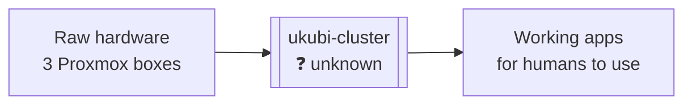
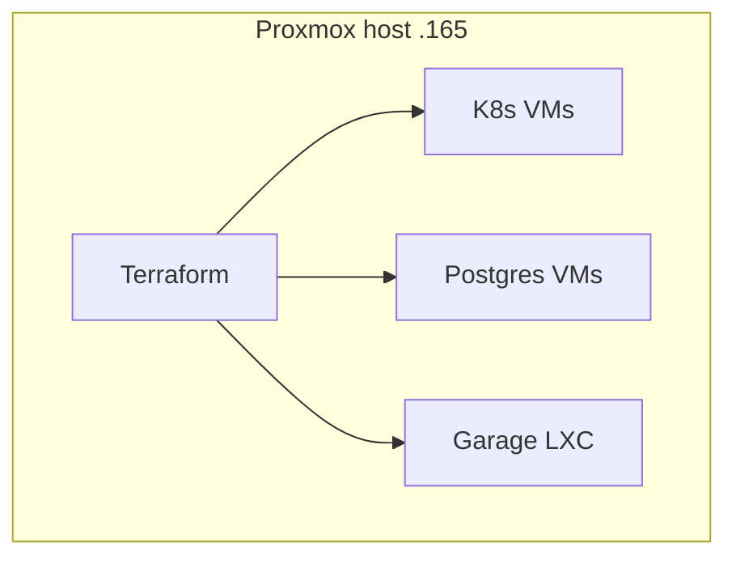
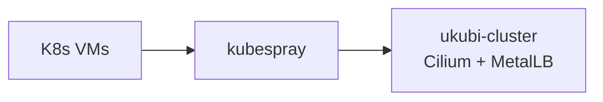
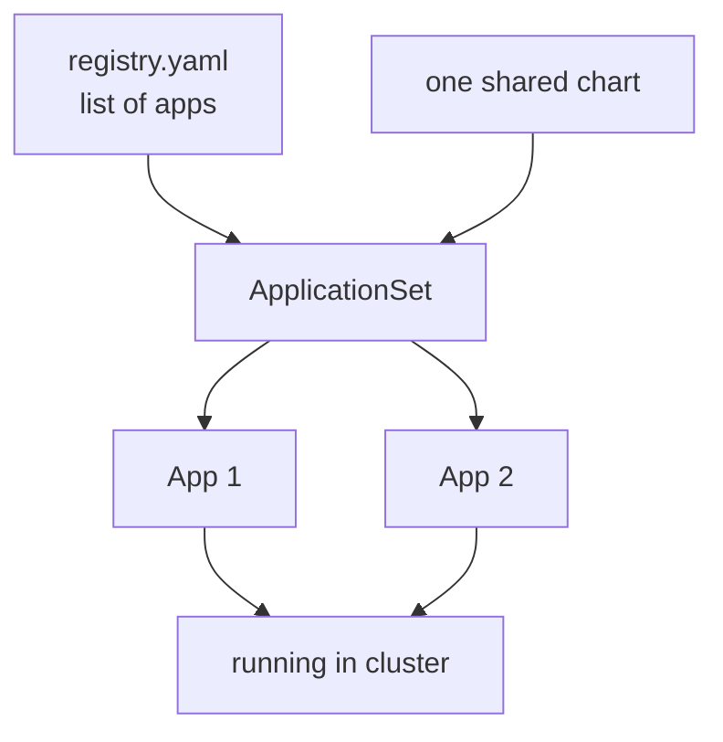
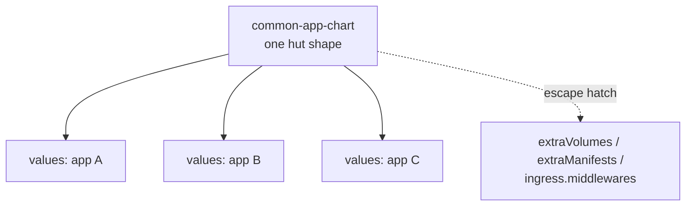
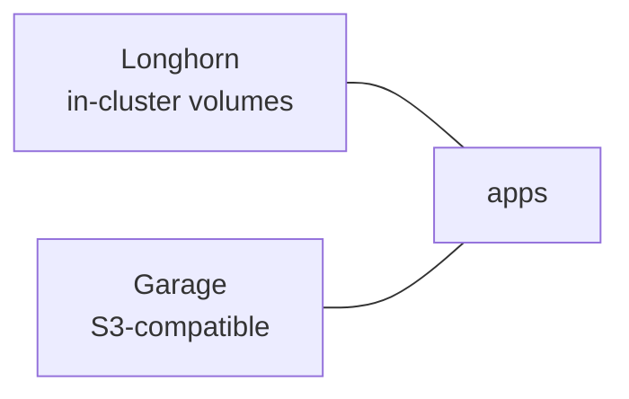
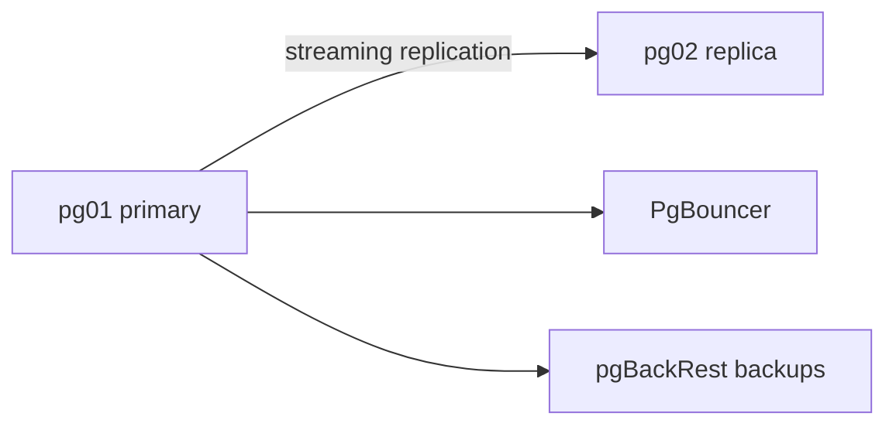
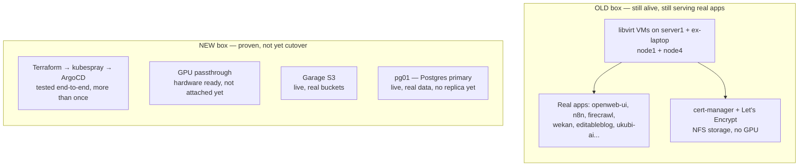
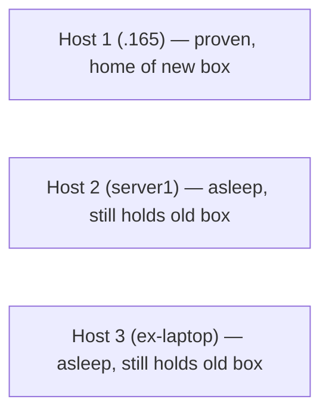
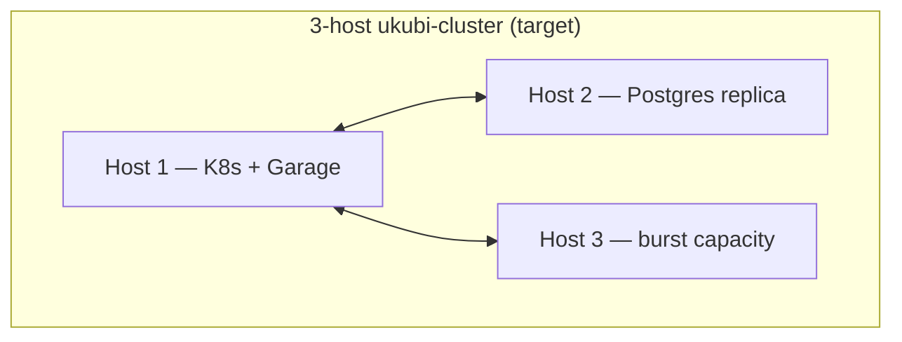

# ukubi-cluster: the story so far

One box. Homelab hardware go in. Apps come out. Let us open box and look inside.

Box work good now. But box no start that way. Box start messy. Story below.

---

## Meet the tribe

Three caveman look at same box, see three different thing.

- 🏛️ **Massinissa, the Architect.** Draw plan on cave wall before first stone
  get stack. Care about shape of whole box, not any one rock.
- 🛠️ **Idir, the Developer.** Want put app in box, fast, no fuss. Care
  about box floor (does my app fit and run), not box wall.
- 🔥 **Dihya, the DevOps.** Keep fire lit at 3am when box scream. Care
  about box not fall down while everyone sleep.

Each layer below, tribe give grunt of approval or grunt of complaint.
Listen close — good and bad both live in same choice.

---

## Chapter 1 — Why we open the box at all

Old setup: apps live in one repo, deployed by hand-ish kustomize files. No
plan written down. Storage pick? Never really pick, just happen. Ingress
pick? Same. Works, but nobody remember why anything is the way it is.

Us say: no more guess. Every big choice get write down
(`DECISION.md` + one ADR file per choice). Infra become buildable from
scratch, not "ask the one guy who remembers."

New rule of box:

- Terraform build the machines.
- kubespray build Kubernetes on top.
- ArgoCD (GitOps) build the apps on top of that.
- Every choice has a written "why," and a list of "no, we tried, rejected."

---

## Chapter 2 — Cracking the box, layer by layer

### Layer 1: Terraform opens the hardware layer

Terraform make VM. Terraform make LXC. All from code, all repeatable.
No more click-click in a web UI and forget what was clicked.

> **Tribe says:**
> - 🏛️ Massinissa: Good — box now live on tablet (code), not stuck in one
>   head. Bad — every new box shape need new tablet carved by hand.
> - 🔥 Dihya: Good — same box every time, no more late-night guessing.
>   Bad — must learn tablet language (HCL) before touching fire.
> - 🛠️ Idir: Idir no care. Idir never touch this layer. Idir only want VM
>   ready when Idir wake up.

### Layer 2: kubespray opens the Kubernetes layer

Kubespray turn plain VM into real cluster. Cilium do network. MetalLB
give apps a real IP on the LAN (no BGP — the home router no support it,
so simple L2 mode chosen and closed, no debate needed).

> **Tribe says:**
> - 🏛️ Massinissa: Good — one true way to build cluster, written once, runs
>   same everywhere. Bad — big call (Cilium chaining, kube-proxy kept)
>   now locked; changing mind later cost a whole new tablet (ADR).
> - 🔥 Dihya: Good — cluster come up clean, no missing piece to chase.
>   Bad — Cilium chaining mode new to Dihya, one more thing to know
>   before the 3am fire.
> - 🛠️ Idir: Idir get stable ground to build app hut on top. Idir happy,
>   Idir say nothing more.

### Layer 3: GitOps opens the deploy layer

One chart for all app. Not one chart per app — that way lie chart
graveyard, fifty copies of the same fifty lines. One registry file say
what apps exist. ArgoCD read file, make apps happen, keep them synced.

> **Tribe says:**
> - 🛠️ Idir: Good — add app to one list (`registry.yaml`), box do rest.
>   Bad — app must fit shared chart shape, no weird custom hut allowed.
> - 🔥 Dihya: Good — box heal itself if someone kick it (self-heal,
>   prune). Bad — bootstrap files not auto-sync; Dihya still hand-apply
>   those once in a while.
> - 🏛️ Massinissa: Good — one pattern for every app, no chart graveyard to
>   maintain. Bad — if one app truly needs a weird shape, the shared
>   chart must grow, and that touches every app at once.

#### Sub-layer: one hut shape, many paint job

Same hut shape for every app — one Helm chart, not fifty. Most app just
bring a `values.yaml` — image name, port, env var, done, paint the hut
own color. Odd app with weird need (extra volume mount, extra raw
manifest, a Traefik middleware) get a generic escape hatch on the same
chart — grafted on, not a whole new hut built from scratch.

> **Tribe says:**
> - 🛠️ Idir: Good — most day Idir just fill values file, never touch
>   chart itself. Bad — first time app need a weird knob, Idir must
>   learn the chart's escape hatch before shipping.
> - 🏛️ Massinissa: Good — chart stay one chart, escape hatches stay
>   generic (not per-app special-case), so the "one pattern" rule holds.
>   Bad — chart itself grow heavier as more escape hatch gets bolted on.
> - 🔥 Dihya: Good — one chart to patch when a bug or CVE hits, not
>   fifty. Bad — a chart bug now hits every app at once, not just one.

### Layer 4: Storage opens up

Longhorn hold app data inside cluster. Garage hold S3-style object data
(backups, big blobs) — replaced an older MinIO setup.

> **Tribe says:**
> - 🔥 Dihya: Good — Longhorn and Garage replace old NFS/MinIO duct
>   tape, easier to reason about at 3am. Bad — Longhorn replica count
>   still weak (2 of 3) until third host wakes up.
> - 🏛️ Massinissa: Good — Ceph was a tempting monster, rejected on paper
>   before it ever bit (ADR). Bad — until Stage 2 lands, storage lives
>   on one host only — that host falls, storage falls with it.
> - 🛠️ Idir: Idir just mounts a volume, never thinks about it. That is
>   the whole point.

### Layer 5: Pigsty opens the database layer

Pigsty run Postgres on its own VMs, outside Kubernetes — box keep
database separate from app cluster, on purpose. Simple primary +
replica, no fancy 3-node quorum, no auto-failover magic. Homelab size
does not need that complexity, so box does not carry it.

> **Tribe says:**
> - 🔥 Dihya: Good — PgBouncer and backup tool come ready-made, less to
>   build by hand. Bad — no auto-failover, so if primary falls at 3am,
>   Dihya must wake up and flip the switch by hand.
> - 🏛️ Massinissa: Good — simple primary/replica chosen on purpose, no false
>   promise of magic HA at homelab size. Bad — until the replica moves
>   off the same host, the database tier is a single point of failure
>   too.
> - 🛠️ Idir: Idir gets a connection string. Idir never sees the two-VM
>   dance behind it.

### Monster fights along the way (short version, no gore)

Building this box was not calm walk. Three monster worth remember:

- **The DNS ghost.** Every service-to-service call inside cluster
  quietly broke. Long hunt. Turns out: Proxmox host itself was typo'd
  as `bnei` + `.dev` domain during install, and that `.dev` leaked into
  every VM's DNS search path — `.dev` is a real internet domain, so
  lookups "succeeded" against the wrong server on the internet instead
  of failing fast. Fixed at the VM level, one Terraform setting.
- **The Secure Boot decoy.** GPU refuse to work, blamed on Secure Boot.
  Real monster hiding underneath: motherboard's IOMMU was off in BIOS
  the whole time. Secure Boot was innocent bystander.
- **The installer that would not talk.** Garage object storage's first
  install script opened an interactive menu and just... waited forever,
  over a connection with nobody there to click it. Thrown out, replaced
  with a plain Terraform + Ansible flow. No menu, no waiting, no ghost.

Each monster: found, fixed, written down so it never surprise us twice.

---

## Chapter 3 — Where box stands today

Two box exist right now, side by side. One old, one new. Only one of
them serve real human today.

Old box: ugly-ish, no plan written down when it was born, but it
work — real user use real app on it, every day, right now. Nobody dare
touch it hard until new box ready to take the weight.

New box: clean, planned, tested more than once, but **never left
running**. Every test so far end in teardown — new box prove itself,
then go back to sleep. No real user on it yet.

Funny twist: host 2 and host 3 are "asleep" for the *new* plan, but
still wide awake running the *old* box. They cannot get their fresh
PVE reinstall until old box's apps move out first (Chapter 4, step
P2/P3). Two arm still busy holding up the house — cannot swap floor
under living room while family still sit in it.

---

## Chapter 4 — Where box is going

Green = done. Grey = still ahead. Garage (P6) got done early, out of
turn — no rule say order must be perfect, just that each step must
work before next step start.

Target box, fully open:

---

## Last words

Box start as mess. Box now stand on one strong leg, two leg still
sleeping. Path to three-leg box already written down, just waiting for
hands to build it. No guessing left — every step has a why, every bug
has a fix, every fix has a note.

Box will stand on three leg soon.

---

## Extra: what the tribe names mean

Three name not pick at random. Real history, real land, real people.

- **Massinissa** — first king to unite the Numidian tribes into one
  kingdom, around 202 BC. Fitting name for the one who draw the plan
  and unite all the pieces into one box.
- **Idir** — Kabyle word for "he lives" / "life," from the verb *idir*.
  Also the stage name of a beloved Kabyle singer. Fitting for the one
  who makes the app live inside the box.
- **Dihya** — real name of the Kabyle/Amazigh warrior queen known as
  "the Kahina," who led resistance in the Aurès in the 7th century.
  Fitting for the one who defends the box and keeps it standing.
